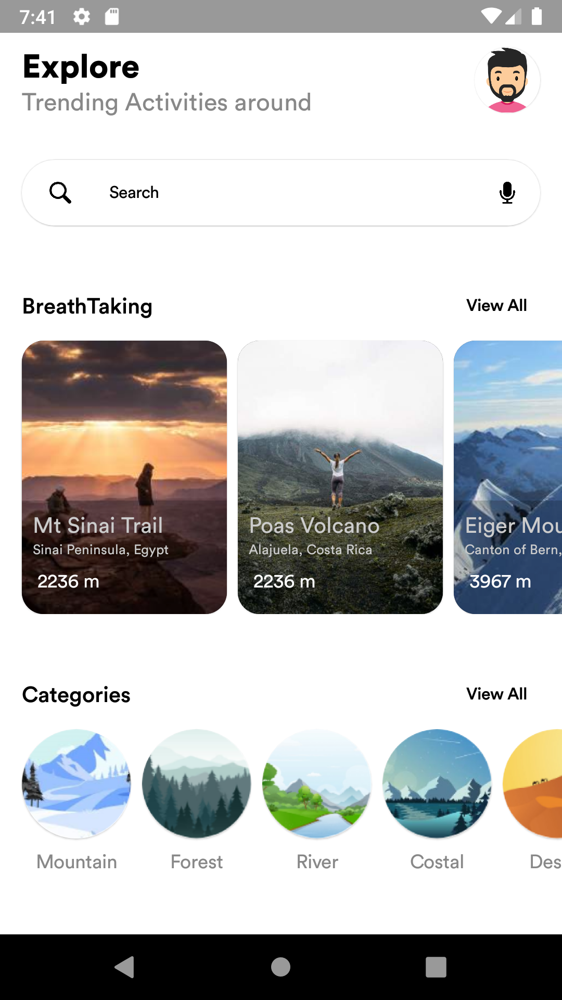
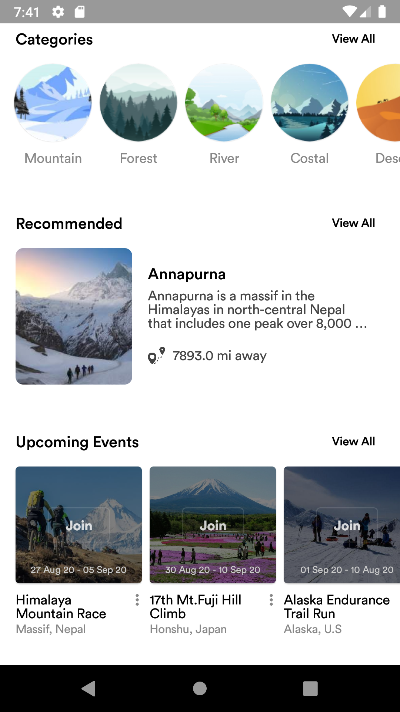
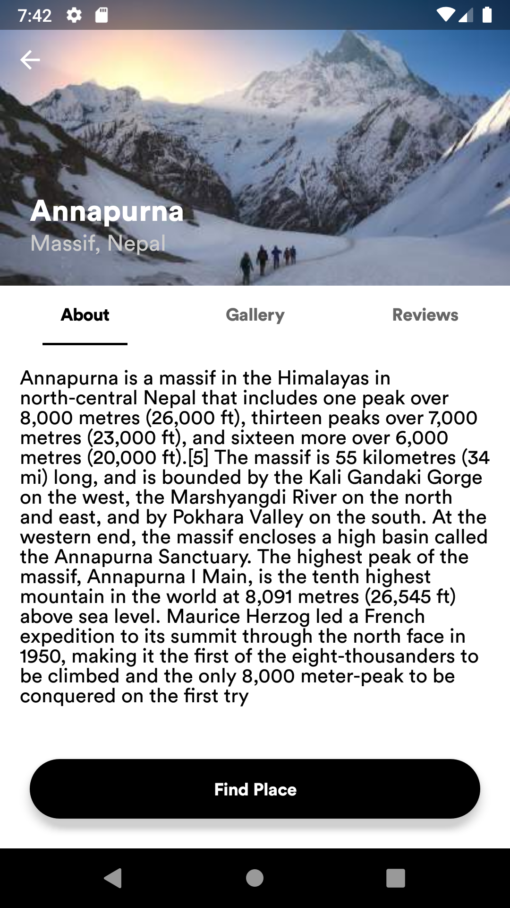
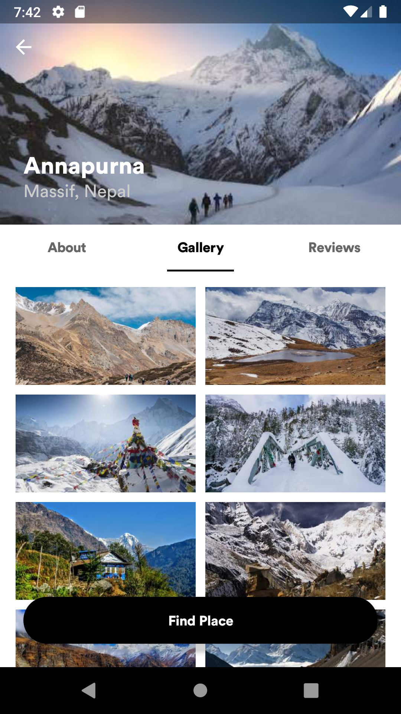
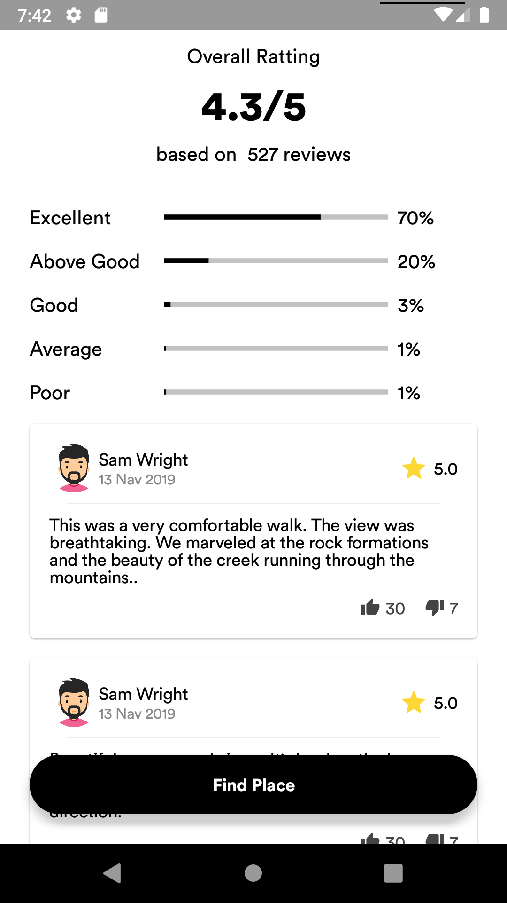

# JetExplore

JetExplore is a Sample Hiking Android Application to demonstrate new [Jetpack Compose Library](https://developer.android.com/jetpack/compose).

## Installation

To try out this sample app, you need to at least use the Canary version of Android Studio 4.1, 
specifically Android Studio 4.1 Canary 9.

## Screenshots

<table>
 <tr>
    <td>
    <td>
    <td>
    <td>
	<td>
  </tr>
 </table>
